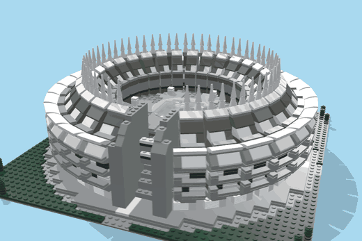
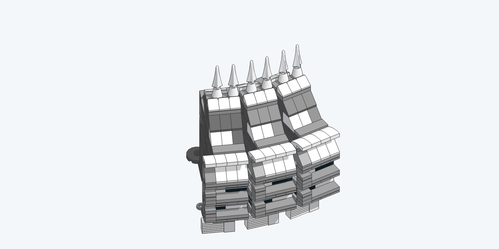
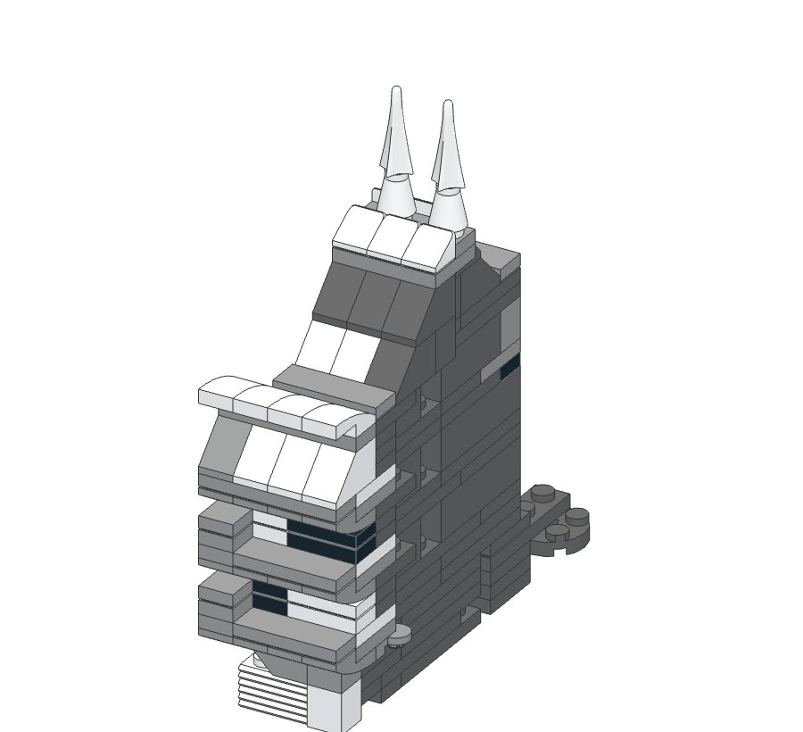
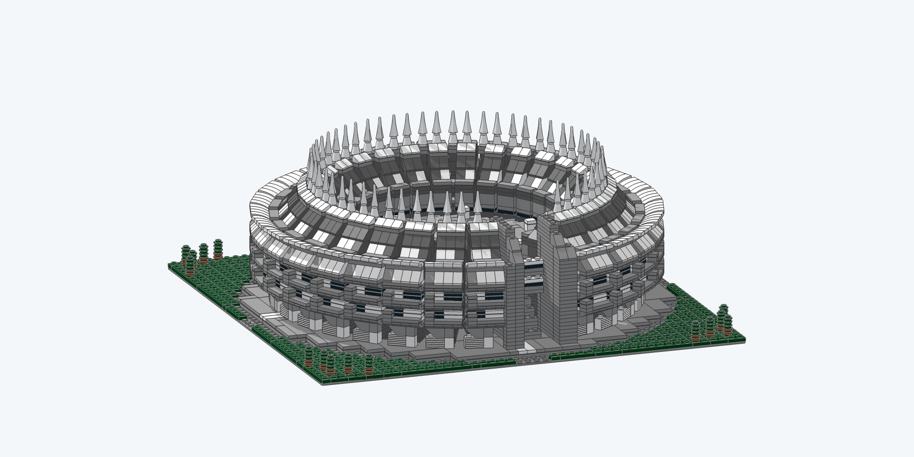

<div align="center">

# Corona de Espinas · LEGO® 1:250

**Una maqueta en piezas LEGO reales de la sede del Instituto del Patrimonio Cultural de España**
(Fernando Higueras y Antonio Miró, Madrid, 1965–1989), diseñada con un agente de IA
y verificada por ordenador pieza a pieza.



**4.937 piezas** · **8 colores** · **28 gajos articulados** · **55 espinas** · **Ø 35 cm** · **153 pasos**

<a href="https://github.com/VictorUceda/corona-de-espinas-lego/raw/main/dist/instrucciones.pdf"></a>

<a href="https://github.com/VictorUceda/corona-de-espinas-lego/raw/main/dist/build.mp4"></a>
<a href="dist/visor_3D.html"></a>
<a href="dist/wanted_list.xml"></a>
<a href="dist/model.mpd"></a>

### El montaje

<a href="https://github.com/VictorUceda/corona-de-espinas-lego/raw/main/dist/build.mp4"></a>

<sub>Clic en la animación para descargar el vídeo completo (MP4, 1080p, 40 s).</sub>

</div>

---

## El modelo

La Corona de Espinas es un anillo de hormigón visto de unos 80 m de diámetro. Tiene tres plantas de voladizos, la última inclinada, un claustro central bajo una cúpula estrella y 55 lucernarios en punta en la coronación.

Una cadena de piezas rectas reproduce ese círculo:

- **28 gajos idénticos de 12,018°** (2·atan(1/9,5)), cada uno montado sobre su propia cuadrícula.
- Dos gajos vecinos comparten dos puntos que caen en la cuadrícula LEGO de ambos a la vez. En esos puntos hay una articulación: un plato redondo con stud central dentro de otro plato redondo, y una bisagra giratoria 1×4. El ángulo queda fijado de forma exacta y sin tensión.
- La cadena forma una C que se abre hacia la entrada, como el edificio real.
- Los gajos se colocan por gravedad, en sentido antihorario: cada uno baja en vertical sobre el anterior.

<p align="center">


</p>

Cada gajo reproduce la fachada fotografiada:

- **Planta baja:** celosía blanca y tornapunta.
- **Plantas:** bandejas con canto curvo (pendientes curvos invertidos colgados desde arriba) y persianas blancas en las que cada junta entre placas es una lama.
- **Nervios:** una aleta vertical en cada uno.
- **Última planta:** inclinada, con un jabalcón en cada nervio.
- **Cubierta:** canalón blanco, lucernarios semihexagonales y la corona con dos espinas por gajo.

Dentro quedan cosas que solo ve quien lo monta:

- el pórtico radial con el pasillo anular;
- los ejes de replanteo del podio;
- el entramado de vigas "vientre de la ballena" bajo la plaza;
- la lámina de agua con la escultura de Chillida que preveía el proyecto de 1965 y que nunca se construyó.

El libro de instrucciones explica todo esto en 43 notas, marcadas como *Arquitectura* o *Técnica LEGO*, junto al paso en el que aparece cada elemento.

<p align="center"></p>

## Garantías de construcción

Todas las piezas son oficiales de LDraw, sin stickers ni impresiones, y todas existen en BrickLink en el color usado. Todas las uniones son legales: nada va forzado ni tensionado. Antes de publicar cada cambio se ejecuta [`scripts/verify.py`](scripts/verify.py) sobre el modelo completo. El resultado está en [`dist/verification_report.json`](dist/verification_report.json).

| Comprobación | Método | Resultado |
|---|---|---|
| Conectividad | Grafo de uniones a partir de los *snaps* de la LDCad Shadow Library | 1 componente |
| Colisiones | Mallas LDraw reducidas 0,1 LDU (FCL) | 0 |
| Construibilidad | Cada pieza, y cada gajo, se introduce en vertical en el orden del libro sin tocar nada | 0 fallos |
| Estabilidad | Centro de masas dentro del polígono de apoyo; ninguna pieza en voladizo sobre un solo stud | OK |
| Resistencia | Uniones más piezas que atraviesan cada plano horizontal | mínimo 55 |

## Contenido

```
dist/        entregables: model.mpd, model_packed.mpd, instrucciones.pdf, build.mp4,
             visor_3D.html, wanted_list.xml, piezas.csv, verification_report.json
scripts/     generación del modelo (Python), verificación, pasos, libro, compra e investigación
render/      renders three.js, imágenes de los pasos, PDF y fotogramas del vídeo (Node + Playwright)
data/        modelo de referencia del edificio (reference.json, planta.svg, alzado.svg), BOM y colores
refs/        datos abiertos incluidos (geo/, BOE) y catálogo de todas las fuentes (index.json)
docs/        notas del libro, decisiones de diseño, técnicas de los sets oficiales, imágenes
```

## Cómo construirlo

1. Descarga [`dist/instrucciones.pdf`](dist/instrucciones.pdf).
2. En BrickLink: *Wanted List → Upload → BrickLink XML* con [`dist/wanted_list.xml`](dist/wanted_list.xml). Son 102 lotes y 4.937 piezas. La lista completa con IDs y colores está en [`dist/piezas.csv`](dist/piezas.csv).
3. Para ver el modelo girando y paso a paso, abre [`dist/visor_3D.html`](dist/visor_3D.html) con doble clic (necesita conexión a internet para cargar three.js). El modelo LDraw [`dist/model.mpd`](dist/model.mpd) se abre en BrickLink Studio, LDCad o LeoCAD.

## Regenerar desde el código

Requisitos: Python 3.11+, Node 20+ y ffmpeg.

```bash
python -m venv .venv && . .venv/bin/activate && pip install -r requirements.txt
(cd render && npm install && npx playwright install chromium)

# Bibliotecas de piezas (no incluidas en el repositorio)
mkdir -p tools && cd tools
curl -LO https://library.ldraw.org/library/updates/complete.zip && unzip -q complete.zip   # -> tools/ldraw
git clone --depth 1 https://github.com/RolandMelkert/LDCadShadowLibrary shadow          # -> tools/shadow
cd ..
```

```bash
python scripts/build_model.py        # dist/model.mpd (base, claustro, 28 gajos, entrada)
python scripts/verify.py             # dist/verification_report.json
python scripts/notas.py              # docs/notas.md
python scripts/steps.py              # build/instructions/steps.json + sec_*.ldr
node   render/render_steps.mjs       # imágenes de los pasos y miniaturas de las piezas
python scripts/book.py && node render/pdf.mjs                  # dist/instrucciones.pdf
python scripts/anim.py               # dist/model_packed.mpd, dist/visor_3D.html, build/viewer.html
node   render/record.mjs build 1920 1080 build/frames && \
  ffmpeg -framerate 30 -i build/frames/f_%05d.png -c:v libx264 -crf 18 -pix_fmt yuv420p dist/build.mp4
python scripts/purchase.py           # dist/wanted_list.xml, dist/piezas.csv
```

`scripts/bom.py` comprueba en Rebrickable que cada pieza existe en su color. Necesita la variable de entorno `REBRICKABLE_KEY` y guarda los resultados en `data/bom_rebrickable.json`.

## Fuentes

Las medidas del edificio (`data/reference.json`) se han obtenido de estas fuentes. El catálogo completo, con URL, autor y licencia de cada documento, está en [`refs/index.json`](refs/index.json).

**Incluidas en el repositorio** (`refs/`):

- **Ortofotos PNOA** (máxima actualidad e históricas 2017 y 2020), vía WMS. © Instituto Geográfico Nacional, [CC BY 4.0 scne.es](https://www.scne.es/). [ign.es/wms-inspire/pnoa-ma](https://www.ign.es/wms-inspire/pnoa-ma)
- **LiDAR PNOA** (segunda y tercera cobertura, recortes de la parcela). © Instituto Geográfico Nacional, CC BY 4.0 scne.es. [Centro de Descargas del CNIG](https://centrodedescargas.cnig.es/CentroDescargas/)
- **Cartografía catastral** (INSPIRE Buildings y CadastralParcel; consulta de la referencia 7773607VK3777D). Fuente: Dirección General del Catastro, uso libre con cita. [ovc.catastro.meh.es](https://www.sedecatastro.gob.es/)
- **Real Decreto 1261/2001**, de declaración como Bien de Interés Cultural. BOE nº 287, de 30/11/2001. Dominio público (art. 13 LPI). [BOE-A-2001-22454](https://www.boe.es/diario_boe/txt.php?id=BOE-A-2001-22454)

**Consultadas y no redistribuidas** (derechos de sus autores; URLs en `refs/index.json`):

- Planos originales de Higueras y Miró: Archivo Histórico Digital de la ETSAM (UPM), Fondo Miró.
- Memoria del proyecto y sección acotada: revista *Arquitectura* nº 299, COAM, 1994.
- Fotografías de Wikimedia Commons, cada una con su autor y licencia.
- Artículos sobre el edificio (Metalocus y otros).
- Libros de instrucciones oficiales de LEGO: solo se estudiaron sus técnicas, resumidas en [`docs/tecnicas_lego.md`](docs/tecnicas_lego.md).

## Inspiración

- [Microduck LEGO booklet](https://huggingface.co/buckets/victor/microduck-lego-booklet/tree/microduck_booklet.pdf)

## Licencia

- **Código** (`scripts/`, `render/`): [MIT](LICENSE).
- **Modelo, instrucciones, imágenes y vídeo** (`dist/`, `docs/`, `data/`): [CC BY 4.0](https://creativecommons.org/licenses/by/4.0/).
- **Datos de terceros** en `refs/`: mantienen su licencia y atribución, indicadas arriba.
- **Piezas LDraw** embebidas en `dist/model_packed.mpd`: © LDraw.org, [CC BY 4.0](https://www.ldraw.org/legal-info).

LEGO® es una marca registrada de LEGO Group, que no patrocina, autoriza ni respalda este proyecto. Estas son instrucciones no oficiales.
